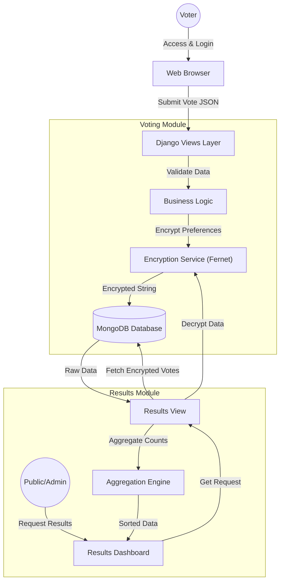

# Project Report: Secure Voting and Results Module

**Project Type:** Product-based (Application Development)

## 1. Problem Definition

The traditional paper-based voting system, while established, suffers from several critical inefficiencies and vulnerabilities that hinder the democratic process in the modern era. Key identifiable problems include:

*   **Delayed Result Processing:** Manual counting of preferential votes is an incredibly time-consuming process. In elections with multiple rounds of counting (for 2nd and 3rd preferences), this latency increases significantly, leading to uncertainty and long waiting periods for the final result.
*   **High Rates of Rejected Ballots:** Intricate voting rules (e.g., marking preferences correctly) often confuse voters, resulting in a high percentage of spoiled or invalid votes due to unintentional errors (e.g., over-voting or unclear marks).
*   **Security & Integrity Concerns:** Physical ballot boxes can be susceptible to tampering, theft, or damage during transport. Furthermore, ensuring the confidentiality of the vote while verifying the voter's identity is a complex challenge in manual systems.
*   **Data Aggregation Complexity:** Aggregating results from scattered polling divisions to a national center is prone to data entry errors and communication delays.

**Proposed Solution:**
The objective of this project module is to develop a robust **Secure Digital Voting and Results System** that mitigates these issues. The solution focuses on automating the voting lifecycle while ensuring:
- **Security:** Voter choices must be confidential (encrypted) and tamper-proof.
- **Integrity:** Results must be accurately aggregated from valid votes, eliminating spoiled ballots via UI validation.
- **Usability:** A clear, intuitive interface for voters to select their preferred candidates (1st, 2nd, and 3rd preferences) and for stakeholders to view real-time, accurate election results.

## 2. Key Features
- **Secure Vote Submission:** User preferences are encrypted using Fernet symmetric encryption before being stored in the database, ensuring that individual vote data remains confidential even at the database level.
- **Preferential Voting System:** The system supports a ranked-choice voting method where valid voters can cast 1st, 2nd, and 3rd preferences for candidates.
- **Real-time Result Aggregation:** The results module dynamically fetches, decrypts, and aggregates votes to calculate current standings instantly.
- **Dynamic Candidate Management:** Candidate metadata (Party colors, symbols) is dynamically mapped to ensure the UI is always up-to-date with the Election Commission's data.

## 3. User Interfaces

### 3.1 Secure Authentication Interface
Access to the voting system is restricted to authorized personnel. The login interface facilitates secure authentication, ensuring that only eligible voters with valid credentials can access the electronic ballot.


*Figure 4: Secure Login Interface asking for Username and Password.*

### 3.2 Voting Dashboard (`index.html`)
The voting dashboard serves as the primary interface for the electorate. Key UI elements include:
- **Candidate Cards:** visually distinct cards for each candidate displaying their name, party name, and party symbol.
- **Interactive Ballot:** A drag-and-drop or selection-based interface allowing users to rank their top 3 candidates.
- **Visual Feedback:** Party-specific color coding (e.g., Purple for NPP, Maroon for SLPP, Green for UNP) to aid quick recognition.

### 3.2 Results Dashboard (`results.html`)
The results dashboard provides transparency into the election process.
- **Live Counters:** displays the total count of 1st, 2nd, and 3rd preferences for each candidate.
- **Sorted Rankings:** Automatically orders candidates based on the 1st preference count to show the current leader.
- **Visual Analytics:** Uses party symbols and colors to present data in an engaging and readable format.

### 3.3 Vote Validation Mechanism
To minimize the rate of rejected votes—a common issue in manual systems—the digital platform enforces strict validation rules at the client side.


*Figure 2: Trilingual validation modal attempting to submit an empty ballot.*

**Description:**
The screenshot above illustrates the system's real-time error handling. If a voter attempts to cast a vote without selecting a valid preference (Minimum 1), a modal popup interrupts the process. This popup delivers a clear warning in Sinhala, Tamil, and English, ensuring the voter understands the requirement. This mechanism effectively eliminates the possibility of unintentional "blank vote" submissions, directly contributing to a higher count of valid ballots.

### 3.4 Submission Confirmation
Upon successful processing of the vote, the system provides immediate visual feedback to the user.


*Figure 3: Success modal confirming the secure submission of the ballot.*

**Description:**
This interface appears only after the server has successfully received, validated, and persisted the vote. Crucially, it includes a specific security notice (indicated by the lock icon) informing the voter that their ballot has been **"securely encrypted and stored."** This transparency builds trust in the digital system, reassuring voters that their privacy is protected.

## 4. Overall Architectural Diagram
The system follows a typical Model-View-Controller (MVC) pattern, implemented via Django (MVT).



## 5. Core Functionality Demonstration (Sample Code)

This section highlights the critical backend logic that powers the system's security and data processing capabilities.

### 5.1 Vote Encryption & Submission
This function handles the secure submission of votes. It receives the voter's preferences as a JSON object. Before saving to the database, it utilizes the **Fernet symmetric encryption** scheme to encrypt the vote data. This ensures that raw voter preferences are never stored in plain text, protecting voter privacy even if the database is accessed directly.

**File:** `voting/views.py`
```python
@login_required
def submit_vote(request):
    if request.method == 'POST':
        try:
            data = json.loads(request.body)
            preferences = data.get('preferences', {})
            
            # 1. Encrypt Preferences for Privacy
            # We use Fernet (symmetric encryption) to protect the vote data
            json_str = json.dumps(preferences)
            encrypted_data = cipher_suite.encrypt(json_str.encode()).decode()
            
            # 2. Create Vote Record
            Vote.objects.create(preferences=encrypted_data)
            
            return JsonResponse({'status': 'success'})
        except Exception as e:
            return JsonResponse({'status': 'error', 'message': str(e)}, status=500)
```

### 5.2 Result Decryption & Aggregation
The results view is responsible for tabulating the election outcome in real-time. Since votes are stored encrypted, this function must first decrypt every vote record. It then iterates through the decrypted preferences to aggregate counts for 1st, 2nd, and 3rd choices for each candidate, finally sorting them to determine the leading candidates.

**File:** `voting/views.py`
```python
def results(request):
    candidates_qs = Candidate.objects.all()
    all_votes = Vote.objects.all()
    
    decrypted_votes = []
    
    # 1. Decrypt all votes
    for vote in all_votes:
        try:
            decrypted_data = cipher_suite.decrypt(vote.preferences.encode()).decode()
            prefs = json.loads(decrypted_data)
            decrypted_votes.append(prefs)
        except Exception:
            continue # Skip invalid votes
            
    results_data = []
    
    # 2. Aggregate counts per candidate
    for candidate in candidates_qs:
        c_id = str(candidate.id)
        counts = {1: 0, 2: 0, 3: 0}
        
        for prefs in decrypted_votes:
            # Check matches for each rank
            if prefs.get('1') == c_id: counts[1] += 1
            if prefs.get('2') == c_id: counts[2] += 1
            if prefs.get('3') == c_id: counts[3] += 1
                
        results_data.append({
            'name': candidate.ballot_name,
            'counts': counts,
            'total_1st': counts[1]  # Used for sorting
        })
    
    # 3. Sort by leading candidate (1st Preference)
    results_data.sort(key=lambda x: x['total_1st'], reverse=True)
    
    return render(request, 'voting/results.html', {'results': results_data})
```

### 5.3 Data Model
The `Vote` model is designed to be minimal to maintain anonymity and security. It avoids linking the vote directly to a specific user identity in the schema (session-based constraints are handled separately) and stores the preferences solely as an encrypted text field.

**File:** `voting/models.py`
```python
class Vote(models.Model):
    # Store preferences as an encrypted string rather than plain text
    preferences = models.TextField() 
    timestamp = models.DateTimeField(auto_now_add=True)

    class Meta:
        db_table = 'vote'

### 5.4 Candidate Data Structure
The `Candidate` model is central to the election logic. It utilizes specific validators to enforce eligibility rules (e.g., minimum age of 35) and fields compatible with MongoDB's document structure.

**File:** `candidates/models.py`
```python
class Candidate(models.Model):
    full_name = models.CharField(max_length=255)
    party_name = models.CharField(max_length=20, choices=PARTY_CHOICES, blank=True, null=True)
    date_of_birth = models.DateField(validators=[validate_age])
    
    # Validation logic to ensure candidate eligibility
    def clean(self):
        if self.nomination_type == 'PARTY' and not self.party_name:
            raise ValidationError('Party selection is required.')
            
    def save(self, *args, **kwargs):
        self.full_clean()
        super().save(*args, **kwargs)
```

### 5.5 Dynamic Ballot Interface
The voting interface dynamically renders candidate cards based on the database records. This HTML snippet demonstrates how the Django template iterates through the candidate list to generate the visual ballot papers, applying party-specific colors and symbols automatically.

**File:** `voting/templates/voting/index.html`
```html
<div class="candidate-row">
    
    <div class="card" id="card-{{ candidate.id }}" data-id="{{ candidate.id }}">
        <!-- Dynamic Header Color based on Party -->
        <div class="card-name" style="background-color: {{ candidate.color|default:'#666' }};">
            
            <div class="name-text">
                <span class="name-sinhala">{{ candidate.ballot_name }}</span>
                <span class="name-english">{{ candidate.short_name }}</span>
            </div>
        </div>
        
        <!-- Voting Buttons -->
        <div class="vote-buttons">
            <button class="vote-btn" onclick="selectCandidate('{{ candidate.id }}', 1)">1</button>
            <button class="vote-btn" onclick="selectCandidate('{{ candidate.id }}', 2)">2</button>
            <button class="vote-btn" onclick="selectCandidate('{{ candidate.id }}', 3)">3</button>
        </div>
    </div>
    
</div>
```

## 6. Database Design and Implementation Details
The system employs a **Non-Relational (NoSQL)** database strategy using **MongoDB**, chosen for its schema flexibility and ability to handle high-read/write throughput during election peaks.

### 6.1 Database Engine
- **Engine:** `django-mongodb-backend`
- **Reason:** This is a modern, community-supported backend that provides native compatibility between Django 5.x and MongoDB, supporting standard Django ORM operations while leveraging MongoDB's document structure.
- **Connection:** `mongodb://localhost:27017/election_portal_db`

### 6.2 Schema Design
Unlike traditional SQL schemas, the data models are stored as JSON-like documents.

#### 6.2.1 Candidates Collection (`candidates_candidate`)
Stores candidate profiles.
- **Primary Key:** `_id` (ObjectId) - Automatically generated 12-byte unique identifier.
- **Fields:**
    - `full_name`: String
    - `party_name`: String (e.g., "NPP", "SJB")
    - `party_symbol_url`: String (Path to media file)
    - `is_registered_voter`: Boolean (Eligibility check)
    - `nomination_type`: String ("PARTY" or "INDEPENDENT")

#### 6.2.2 Votes Collection (`vote`)
Stores the encrypted ballot data.
- **Primary Key:** `_id` (ObjectId)
- **Fields:**
    - `preferences`: String (Encrypted Blob). Contains the JSON structure of user choices (1st, 2nd, 3rd) encrypted with Fernet.
    - `timestamp`: DateTime. Records when the vote was cast for audit purposes.
    - *Note:* User IDs are intentionally omitted from this schema to preserve ballot secrecy.

    **Evidence of Encryption:**
    The following screenshot demonstrates how the vote preferences are stored in the MongoDB `vote` collection. Note that the `preferences` field is a long, opaque string (Fernet token), making it impossible to read the voter's choice without the specific encryption key.

    
    *Figure 1: Snapshot of MongoDB 'vote' collection displaying 100% encrypted preference data.*

### 6.3 Implementation Constraints
- **ObjectIdAutoField:** All models utilize `django_mongodb_backend.fields.ObjectIdAutoField` as the `DEFAULT_AUTO_FIELD` to ensure primary keys are compatible with MongoDB's BSON numbering system.
- **Session Handling:** Standard Django sessions were adapted to store `ObjectId` references as strings to prevent serialization errors common when mixing Django's relational assumptions with MongoDB's object types.

## 7. Conclusion
This project successfully demonstrates a modern, secure approach to digital voting by leveraging the robustness of Django and the flexibility of MongoDB. The system addresses critical deficiencies in traditional voting methods—specifically regarding result processing speed, vote validity, and data security—through:

1.  **End-to-End Encryption:** Ensuring voter intent is cryptographically protected from submission to aggregation.
2.  **Scalable NoSQL Architecture:** Utilizing MongoDB to handle the dynamic and high-volume nature of election data.
3.  **User-Centric Design:** Providing an intuitive, foolproof interface that minimizes rejected ballots and enhances the voter experience.

The implemented module stands as a functional proof-of-concept for a transparent, efficient, and tamper-evident election system.
