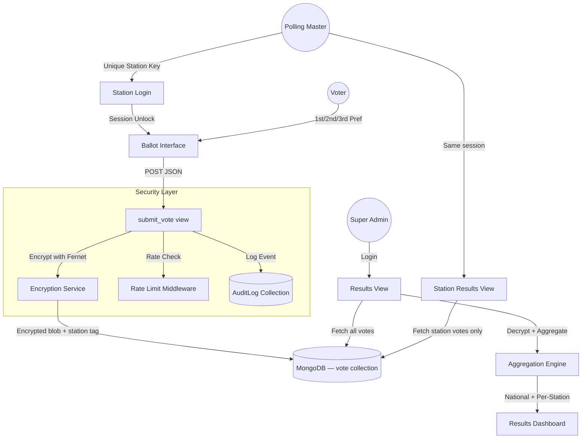

# Project Report: Secure Voting and Results Module

**Project Type:** Product-based (Application Development)  
**Last Updated:** 2026-07-02  

---

## 1. Problem Definition

The traditional paper-based voting system, while established, suffers from several critical inefficiencies and vulnerabilities that hinder the democratic process in the modern era. Key identifiable problems include:

* **Delayed Result Processing:** Manual counting of preferential votes is an incredibly time-consuming process. In elections with multiple rounds of counting (for 2nd and 3rd preferences), this latency increases significantly.
* **High Rates of Rejected Ballots:** Intricate voting rules often confuse voters, resulting in a high percentage of spoiled or invalid votes due to unintentional errors.
* **Security & Integrity Concerns:** Physical ballot boxes can be susceptible to tampering, theft, or damage. Ensuring confidentiality while verifying voter identity is complex in manual systems.
* **No Geographic Segregation:** Traditional digital systems aggregate all votes into one database, making it impossible to audit results per polling station without manual cross-referencing.
* **No Audit Trail:** Manual systems lack a tamper-evident log of all actions performed during the voting session.

**Proposed Solution:**  
A **Secure Digital Voting System** with per-polling-station authentication, encrypted vote storage, rate limiting, and an immutable audit log.

---

## 2. Key Features

| Feature | Description |
|---|---|
| **Per-Station Admin Login** | Each of Sri Lanka's 160 polling divisions has a unique cryptographic login key. Polling masters sign in once at session start (7 AM); the terminal stays active all day. |
| **Encrypted Vote Storage** | Fernet symmetric encryption — raw vote data is never stored in plain text, even in the database. |
| **Station-Scoped Votes** | Every vote record is tagged with the originating polling station and district code. |
| **Station Results View** | After voting ends, the polling master can view only their station's results — no re-authentication needed. |
| **Global Results Dashboard** | Super-admin sees all votes aggregated nationally with a per-station breakdown. |
| **Rate Limiting** | 5 failed station key attempts per IP per 10 minutes → automatic lockout. No Redis required. |
| **Audit Log** | Every event (login, vote cast, logout, rate-limit hit, voter ID changes) recorded to an immutable MongoDB collection. |
| **Temporary Voter ID UI** | Stub voter ID management (create, bulk import, list, delete) for POC testing — will connect to the real ID system. |
| **Preferential Voting** | 1st, 2nd, and 3rd preference support with real-time aggregation. |

---

## 3. User Interfaces

### 3.1 Polling Station Login (`station_login.html`)

The polling master authentication interface. A single unique login key field unlocks the terminal for the entire voting session.

- Dark glassmorphism design with floating gold particles
- Password visibility toggle
- Rate-limited: 5 failed attempts → 10-minute IP lockout
- Redirects to ballot immediately on success

### 3.2 Voting Ballot (`index.html`)

The primary voter-facing interface. **Blocked if no station session is active.**

- Dynamic candidate cards with party colour coding and symbols
- Interactive 1st / 2nd / 3rd preference selection
- Trilingual (Sinhala / Tamil / English) validation
- One submission per session (prevents double voting)

### 3.3 Station Results (`station_results.html`)

Post-voting read-only view accessible to the polling master using the same day session.

- Shows only votes from that polling station
- Preference breakdown per candidate with progress bars
- Printable layout

### 3.4 Global Results (`results.html`)

Super-admin view showing national results plus per-station breakdown.

- Live preference counts (1st / 2nd / 3rd)
- Sorted by 1st preference count
- Station-level drill-down

### 3.5 Voter ID Management (`voter_id_list.html` etc.)

Stub system for POC testing — will be replaced by the real external ID system.

- List with search and filter by district, division, voted status
- Single create form with dynamic district → division cascade
- Bulk CSV import with live line counter
- Delete with confirmation + audit log entry

---

## 4. System Architecture


```mermaid
graph TD
    PM((Polling Master)) -->|Unique Station Key| SL[Station Login]
    SL -->|Session Unlock| BL[Ballot Interface]

    Voter((Voter)) -->|1st/2nd/3rd Pref| BL
    BL -->|POST JSON| SV[submit_vote view]

    subgraph "Security Layer"
        SV -->|Encrypt with Fernet| ENC[Encryption Service]
        SV -->|Rate Check| RL[Rate Limit Middleware]
        SV -->|Log Event| AL[(AuditLog Collection)]
    end

    ENC -->|Encrypted blob + station tag| DB[(MongoDB — vote collection)]

    Admin((Super Admin)) -->|Login| RV[Results View]
    RV -->|Fetch all votes| DB
    RV -->|Decrypt + Aggregate| AG[Aggregation Engine]
    AG -->|National + Per-Station| RD[Results Dashboard]

    PM -->|Same session| SR[Station Results View]
    SR -->|Fetch station votes only| DB
```

---

## 5. Data Models

### 5.1 `PollingStation`

```python
class PollingStation(models.Model):
    id              = ObjectIdAutoField(primary_key=True)
    district_number = models.IntegerField()          # 01–22
    district_name   = models.CharField(max_length=100)
    division_code   = models.CharField(max_length=5)  # e.g. "J"
    division_name   = models.CharField(max_length=100) # e.g. "Kaduwela"
    login_key       = models.CharField(max_length=64, unique=True)  # secrets.token_urlsafe(32)
    is_active       = models.BooleanField(default=True)
    created_at      = models.DateTimeField(auto_now_add=True)
```

### 5.2 `Vote`

```python
class Vote(models.Model):
    id              = ObjectIdAutoField(primary_key=True)
    preferences     = models.TextField()            # Fernet-encrypted JSON
    polling_station = models.CharField(max_length=200, null=True, blank=True)  # "Colombo / Kaduwela"
    station_code    = models.CharField(max_length=20,  null=True, blank=True)  # "01-J"
    voted_at        = models.DateTimeField(auto_now_add=True)
```

### 5.3 `TempVoterId`

```python
class TempVoterId(models.Model):
    id         = ObjectIdAutoField(primary_key=True)
    voter_id   = models.CharField(max_length=20, unique=True)  # NIC
    full_name  = models.CharField(max_length=200)
    district   = models.CharField(max_length=100)
    division   = models.CharField(max_length=100)
    has_voted  = models.BooleanField(default=False)
    created_at = models.DateTimeField(auto_now_add=True)
```

### 5.4 `AuditLog`

```python
class AuditLog(models.Model):
    id           = ObjectIdAutoField(primary_key=True)
    event_type   = models.CharField(max_length=20)   # STATION_LOGIN | VOTE_CAST | RATE_LIMITED | …
    station_name = models.CharField(max_length=200, null=True, blank=True)
    ip_address   = models.GenericIPAddressField(null=True, blank=True)
    details      = models.TextField(blank=True)
    timestamp    = models.DateTimeField(auto_now_add=True)
```

---

## 6. Core Functionality

### 6.1 Station Login & Session Isolation

```python
def station_login(request):
    if request.method == 'POST':
        login_key = request.POST.get('login_key', '').strip()
        try:
            station = PollingStation.objects.get(login_key=login_key, is_active=True)
            # Establish day-long session
            request.session['polling_station_id']   = str(station.id)
            request.session['polling_station_name'] = str(station)
            request.session['has_voted'] = False
            request.session.save()
            # Write audit event
            AuditLog.objects.create(event_type='STATION_LOGIN', station_name=str(station), ...)
            return redirect('voting_index')
        except PollingStation.DoesNotExist:
            AuditLog.objects.create(event_type='LOGIN_FAILED', ...)
            messages.error(request, 'Invalid or inactive station key.')
```

### 6.2 Vote Submission with Station Tagging

```python
def submit_vote(request):
    station_id   = request.session.get('polling_station_id')
    station_name = request.session.get('polling_station_name')

    # Block if no station session
    if not station_id:
        return JsonResponse({'status': 'error', 'message': 'Station session not active.'}, status=403)

    # Block double voting
    if request.session.get('has_voted'):
        return JsonResponse({'status': 'error', 'message': 'Already submitted.'}, status=429)

    # Encrypt and store with station tag
    encrypted_data = cipher_suite.encrypt(json.dumps(preferences).encode()).decode()
    Vote.objects.create(
        preferences=encrypted_data,
        polling_station=station_name,   # "Colombo / Kaduwela"
        station_code=station_code,       # "01-J"
    )
    request.session['has_voted'] = True
    AuditLog.objects.create(event_type='VOTE_CAST', station_name=station_name, ...)
```

### 6.3 Rate Limiting Middleware

```python
class RateLimitMiddleware:
    MAX_ATTEMPTS   = 5    # configurable via settings.RATE_LIMIT_STATION_LOGIN
    WINDOW_SECONDS = 600  # 10 minutes

    def __call__(self, request):
        if request.method == 'POST' and request.path == '/voting/station/login/':
            ip = _get_client_ip(request)
            if _is_rate_limited(ip, self.MAX_ATTEMPTS, self.WINDOW_SECONDS):
                AuditLog.objects.create(event_type='RATE_LIMITED', ip_address=ip, ...)
                return JsonResponse({'status': 'error', 'message': 'Too many attempts.'}, status=429)
        return self.get_response(request)
```

---

## 7. MongoDB Collections Summary

| Collection | Key Fields | Notes |
|---|---|---|
| `polling_station` | `login_key` (unique), `district_number`, `division_code` | 160 entries seeded from Section 9(3) data |
| `vote` | `preferences` (encrypted), `polling_station`, `station_code`, `voted_at` | All votes tagged to originating station |
| `temp_voter_id` | `voter_id` (unique), `has_voted` | POC stub — replace with real ID system |
| `audit_log` | `event_type`, `station_name`, `ip_address`, `timestamp` | Immutable; admin read-only |
| `candidates_candidate` | `full_name`, `party_name`, `ballot_name` | Election candidates |

---

## 8. Sri Lanka Polling Division Reference

Based on Section 9(3) of the Registration of Electors Act No. 44 of 1980:

- **22 Electoral Districts**
- **160 Polling Divisions** seeded with unique login keys
- Each polling master receives a 43-character `secrets.token_urlsafe(32)` key specific to their division

To regenerate all keys (e.g., after a security incident):
```python
# In Django admin → PollingStation → select all → "Regenerate login key"
```

---

## 9. Conclusion

This system addresses the original problem areas with the following implementations:

1. **Geographic vote segregation** — every vote is tagged to its originating polling station, enabling per-division audits.
2. **End-to-end encryption** — Fernet encryption ensures voter preferences remain confidential at rest.
3. **Tamper-evident audit log** — every action is recorded; the log is read-only in the admin panel.
4. **Rate limiting** — brute-force attacks on station keys are blocked at the middleware level.
5. **Scalable NoSQL architecture** — MongoDB handles high-volume election-day writes with no schema bottleneck.
6. **Temporary ID stub** — voter ID management is built as a pluggable module, ready to connect to the real ID verification system.

The system stands as a functional proof-of-concept demonstrating a transparent, geographically isolated, and tamper-evident digital election infrastructure.
